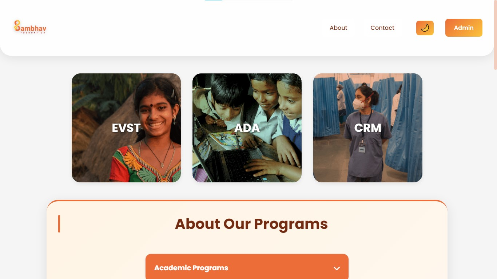

# Sambhav Foundation - Education Excellence

Welcome to the Sambhav Foundation website repository. This project is built to showcase our educational programs, facilities, and strategic partnerships, providing an engaging and responsive experience for all users.

[](https://vishal6395.github.io/sambhav_website/)

## Table of Contents
- [Overview](#overview)
- [Preview](#preview)
- [Features](#features)
- [Technology Stack](#technology-stack)
- [Installation](#installation)
- [Usage](#usage)
- [File Structure](#file-structure)
- [Contributors](#contributors)
- [Contributing](#contributing)
- [License](#license)
- [Contact](#contact)

## Overview
The Sambhav Foundation website is designed to promote educational excellence and innovation. The site features an intuitive user interface with a responsive design, ensuring a seamless browsing experience across desktops and mobile devices.

## Preview
Below is a preview of the webpage:

[](https://vishal6395.github.io/sambhav_website/)

Click the image or the **View Live** button above to visit the live site.

## Features
- **Responsive Navigation:**  
  - Desktop navigation with links to About, Contact, and Admin sections.
  - A mobile hamburger menu for smaller screens.
- **Theme Toggle:**  
  Switch between light and dark themes with a dedicated toggle button.
- **Hero Section:**  
  Quick access to program pages like EV Technician (EVST), Data Analyst (ADA), and CRM.
- **About Section:**  
  Detailed information about academic programs, facilities, classes, teacher profiles, and a photo gallery.
- **Sponsors Section:**  
  Showcases strategic partnerships, including details about the sponsorship journey, collaboration impact, and financial highlights.
- **Contact Form:**  
  A fully functional contact form integrated with Web3Forms for easy message submissions.
- **Admin Access:**  
  An admin button redirects to the admin panel for backend management.

## Technology Stack
- **HTML5:**  
  Provides the structure and content of the website.
- **CSS3:**  
  Styles the website (referenced via `assets/css/styles.css`).
- **JavaScript:**  
  Adds interactivity and dynamic functionality (referenced via `assets/script/script.js`).
- **Firebase:**  
  Used for app initialization and database interactions.
- **Font Awesome:**  
  Delivers a wide range of icons used throughout the site.

## Installation
To run the project locally, follow these steps:

1. **Clone the repository:**
   ```bash
   git clone https://github.com/vishal6395/sambhav-foundation.git
   cd sambhav-foundation
